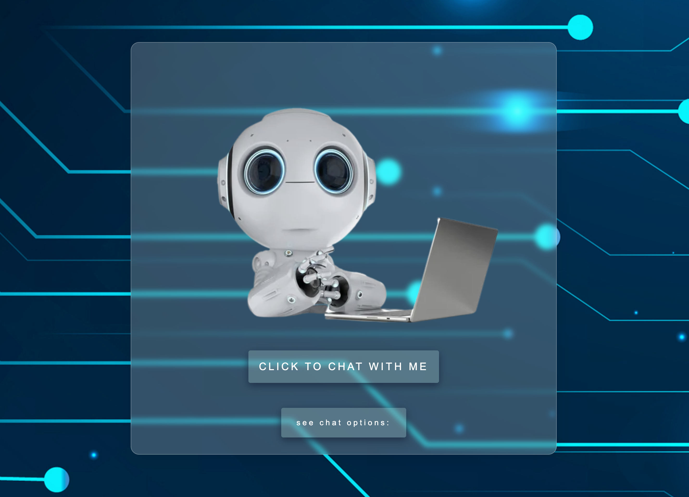

Voice chatbot - Sterling

============
 
This voice bot is coded using Web speech API. Through it's speech recognition and synthesis, the bot is able to answer some predefined questions or statements as well as perform a few predefined tasks.

---

## Features

- Voice recognition
- Voice synthesis
- Predefined statements/questions that the voice chatbot will respond to
- Predefined tasks that the voice chatbot will perform when prompted
- Charismatic and cheeky voice chatbot
- Other awesome features to be added as I learn

![[chat prompts dropdown menu]](chatbot-prompts-preview.png)

---

## Usage

- Click the "see chat options" button to reveal a list of prompts that can be used to communicate with Sterling
- Click the "CLICK TO CHAT WITH ME" button and say one of the listed prompts

---

## License

> You can check out the full license [here](https://github.com/NelLoyola/talkingBot/blob/master/LICENSE)

This project is licensed under the terms of the **MIT** license.
